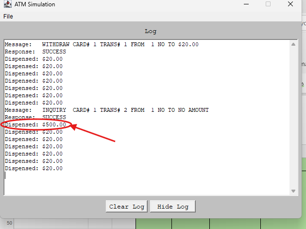

>   **SENG 637 - Software Testing, Reliability, and Quality**

**Lab. Report \#1 – Introduction to Testing and Defect Tracking**

| Group: 14      |
|-----------------|
| Student 1: Ayodele Oluwabusola                 |   
| Student 2: Gabriel Gabari             |   
| Student 3: Remi Oyediji               |   
| Student 4: Taiwo Oyewole                |   

**Table of Contents**

(When you finish writing, update the following list using right click, then
“Update Field”)

[1 Introduction](#_Toc439194677)

[2 High-level description of the exploratory testing plan	1](#_Toc439194678)

[3 Comparison of exploratory and manual functional testing	1](#_Toc439194679)

[4 Notes and discussion of the peer reviews of defect reports	1](#_Toc439194680)

[5 How the pair testing was managed and team work/effort was
divided	1](#_Toc439194681)

[6 Difficulties encountered, challenges overcome, and lessons
learned	1](#_Toc439194682)

[7 Comments/feedback on the lab and lab document itself	1](#_Toc439194683)

# Introduction

This report shares our group's experience testing the ATM simulation system for the Lab. Before this lab, a couple of us mostly knew about software testing from theory. We thought exploratory testing was just a freeform way to check how a system behaves, while manual functional testing seemed more structured, following specific test cases. But doing these tests gave a much clearer picture. We got hands-on experience with both methods, which helped us understand how they work in real-world software quality assurance.

For our Defect Report, we initially used Azure DevOps to track bugs. However, the CSV export did not adequately present all key details. To ensure clarity and completeness, we manually logged the defects in an Excel sheet.  

You can find the *Defect Report* directly in the repository's root directory: 

# High-level description of the exploratory testing plan

# Test Strategy
Based on the requirements extracted from Appendix B, we outlined the scope, approach, and all testing activities related to the ATM Simulation system. The plan identifies the features to be tested, test types to be performed, and who will be performing each test.
## Scope of Testing
### Features to be Tested
As a team, we tested the ATM system to ensure it functions as expected. In our testing approach, we considered both user interaction with the ATM and the system's internal behavior. The user-focused tests evaluate how the ATM responds to inputs, while system-level tests check backend processing, data accuracy, and error handling. Below is a breakdown of key areas we’ll focus on:   

### **Test Areas Divided by Focus**  
### **User Interaction Tests**  
| **Test Area** | **What We’re Checking** |
|----------------------|----------------| 
| Card Handling | A customer inserts an ATM card, and the system detects valid/invalid cards. The ATM retains the card after three failed PIN attempts.
| PIN Validation | A customer enters their PIN, and the ATM validates it. If invalid, the system prompts for re-entry, and the card is retained after three failed attempts.
| Cash Withdrawal | A customer can withdraw cash from their linked account in multiples of $20, with bank approval required before dispensing the cash.
| Deposit Transactions | A customer can deposit cash and/or checks into any linked account by entering the deposit amount into the ATM, with manual envelope verification.
| Fund Transfers | A customer can transfer funds between any two accounts linked to their card, with proper validation of both accounts. 
| Balance Inquiry | A customer can check the balance of any account linked to their card.
| Transaction Cancellation | A customer can cancel any ongoing transaction by pressing the Cancel key at any point during the process. 
| Grammatical Errors | The ATM displays system messages free from grammatical errors and typos.

### **System-Level Tests**  
| **Test Area** | **What We’re Checking** | 
|----------------------|----------------|
| System Startup & Shutdown | The operator can power on the system, and properly shut it down when needed.
| Receipts | A customer can receive a printed receipt with accurate transaction details.
| Error Handling | The system provides appropriate error messages for invalid inputs.
| Account Type Validation | The system correctly identifies and displays the type of account for the customer. 
| Transaction Logging | The system logs all transactions correctly.

## Test Types

**System Testing:** We conducted a complete, integrated system test to evaluate the system's compliance with the specified requirements.

## Test Logistics
### Who Will Test Each Functionality
The Exploratory Testing was conducted by two members of the team, and so was the Manual scripted testing. The same set of tests was executed and peer-reviewed. This approach ensured comprehensive coverage from multiple perspectives. Below is a table of how each test area was distributed in pairs. Each pair conducted an extensive testing of each test area.

**Squad 1:**
| **Test Area**        | **Reviewed By**   |
|--------------------------|-------------------|
| Receipts            | Remi and Gabriel       |
| Cash Withdrawal     | Remi and Gabriel         |
| Deposit Transaction  | Remi and Gabriel         |
| Transaction Cancellation | Remi and Gabriel     |
| Grammatical Errors   | Remi and Gabriel         |
| Transaction Logging  | Remi and Gabriel         |

**Squad 2:**

| **Area Reviewed**        | **Reviewed By**   |
|--------------------------|-------------------|
| Card Handling     | Ayo and Taiwo       |
| PIN Validation       | Ayo and Taiwo         |
| Fund Transfer        | Ayo and Taiwo         |
| Balance Inquiry      | Ayo and Taiwo         |
| System Startup       | Ayo and Taiwo         |
| Error Handling       | Ayo and Taiwo       |

With this, we ensure that everyone is involved in the testing process and that all aspects of the software, including functionality, usability, and system performance, are validated from diverse viewpoints, leading to more thorough and effective testing.

## When will the test occur?

The team started testing once the following were in place; 
- Software is available for testing.
- Test Areas have been identified and created.
- Test Environments (PC)
**Test Environment is built:** Windows and MacBook

# Comparison of exploratory and manual functional testing
- We noticed that each tester in the pair discovered different issues during exploratory testing. This highlights how exploratory testing gives testers the freedom to explore the system in their way, leading to the discovery of a wider range of bugs that might not be uncovered through scripted testing.
- Some of the issues we discovered during the manual scripted test (MFT) had already been covered and addressed, leaving little to be done in this phase.

# Notes and discussion of the peer reviews of defect reports

Summary of our Defect Report

*For version 1.0*
- Total Number of Bugs found: 21
- Bugs Resolved: 8
- Unresolved: 13

To mention a few, during the peer review, the first pair in our group observed several unusual behaviors in ATM System Version 1.0/1.1. One major issue was incorrect transaction calculations.  

For example:  
- Depositing "$100" into a savings account resulted in a balance of "$190", even though the initial balance was "$100".  
- Transferring "$90" from the checking account to the savings account showed "$89.50" on the receipt instead of "$90".  

Initially, we thought the discrepancies might be due to transaction fees. However, since no such charges were mentioned in the system requirements, we reported these cases as bugs.

The second pair in our group observed significant issues with the withdrawal function in ATM System Version 1.0.  

Key findings:  
- Withdrawing $20 or $40 resulted in an extra $20 being dispensed (e.g., $40 for $20, $60 for $40).  
- A $60 withdrawal resulted in $100 being dispensed, with the full amount deducted from the account.  
- However, attempting to withdraw $200 caused the ATM to dispense a $20 bill repeatedly, as long as both the account and the ATM had sufficient funds.  
- Strangely, the $200 withdrawal bug did not affect the account balance but impacted the ATM itself, essentially allowing unlimited withdrawals.  

If this issue existed in a real-world system, it would cause severe financial losses, as the ATM would continue dispensing money without proper deductions. These cases were reported as critical bugs.

In addition to the previously mentioned issues, we also observed anomalies during the Balance Inquiry test.  

One major issue was that when performing a **balance inquiry on the savings account for card 1, the system dispensed "$500", even though it did not have that amount available.  

This unexpected behavior was noted and reported as a critical bug.

*For version 1.1*

Some bugs were fixed from v1.1 but new bugs were introduced. 
- Total Number of Bugs found: 6

For example:  
- The System shows "Unknown error before the amount selected is dispensed from the system and the n displays the balance 
- The balance shows the current balance + the amount deposited, but short of $0.10

Some issues were critical while some had a low impact on the system but it is important to reduce the number of abnormalities the system has as much as we can even if no system is 100% bug-free

Below are links to illustrations/screenshots of some bugs;

-Typographical Error

- $500 Bill Spill

- No Currency sign

More clips of bugs detected can be found in the Media file.

# How the pair testing was managed and teamwork/effort was divided 

The team members performed exploratory testing in pairs and recorded the defects found. In the end, we all reviewed all defects and reported them in the bug tracking tool. 

Each member also ran the same tests individually to ensure consistency and documented the issues we found. This way, we tracked defects effectively and also confirmed fixes when we retested.

For the Regression Test, we did it as a group, we took turns testing and tracking the process.

The aim is to be thorough but efficient. Catch as many issues as possible while keeping our testing structured and easy to follow.

# Difficulties encountered, challenges overcome, and lessons learned

*Difficulties encountered*

- We had challenges exporting our tracked bug to excel on Azure DevOps initially but after taking to understand the system, we were able to solve this issue
- 
*Lessons learned*

- We learned as a team that issues or bugs reported need to be revalidated to ensure consistency because it is possible that a party does not have the same experience as the other or one party missed out on a key detail that can impact the overall user experience
- This assignment further established to us that no system is 100% bug-free because we continually discovered more bugs as we explored the system further

# Comments/feedback on the lab and lab document itself

- The directions and steps for this assignment were detailed and self-explanatory, making them easy to follow after reading.
- This lab provided valuable insight into properly identifying and documenting defects.
- Testing the ATM system in different ways showed how bugs can appear in unexpected places
